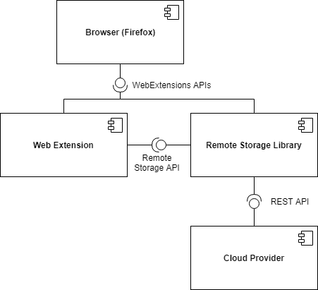
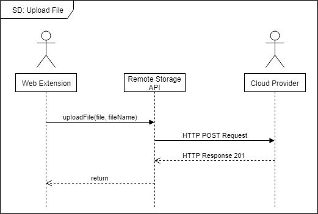

# OO Design & UML

## Architecture

 

Above is a simple architecture diagram of an extension that makes use of our API, represented by Remote Storage Library. The web extension is a general representation that could encapsulate any number of objects. The browser represents the environment in which the system depicted above will be run. The cloud provider again encapsulates a number of different providers, the number of which could grow in further development.

When designing this architecture model for our system we have decided to represent the storage API as a separate entity. This is because, while we currently have implemented our API as an extension, it is intended to be used as a library that is external to the system making use of it with no reliance on the general structure of the extension making use of it. However, due to the current implementation being an extension, it was important for us to make note of the relationship between the library and API. The cloud provider is totally external to our API, with all interactions between the components being through the cloud providers REST API.

The model above did inform what the intention of our final API was going to be. Mainly that the API acts as an abstraction of the process of making requests to these various storage providers. This is accomplished by implementing a set of abstract functions that can be used to interact, via our API, with whatever storage provider is selected. These functions are discussed in the section below.
 
## Class Structure

 

Above is a simple representation of how the primary elements of our API behave. In our API we have two classes that a storage object can be created from. The GoogleStorage class, and the OneDriveStorage class. Both of these classes, whilst not formally being an implementation of an abstract class, possess the exact same parameters, and return types.

The implementations of the RemoteStorage objects have been separated due to the very different ways in which each storage provider handles the files provided to it. For example OneDrive handles its files and folders by name, disallowing duplicates. Whereas GoogleDrive operates entirely on an ID based system, with the name of the file being of no importance. These different approaches to file access resulted in the implementations of each class being quite unique. But by following the design laid out by the class diagram above, we not only greatly simplify testing but also provide a guideline for how to expand the API in future.

Another important goal of this system model was to ensure that in the final implementation, changing the storage provider used by the system would not require the re-writing of code due to the differences between the providers. This model achieves this by enforcing a strict set of inputs and outputs, but allowing the class to reach these inputs and outputs in whichever way is necessary.

Another feature of our API that is aided by this model is our folder system, and the way that our API will ensure that all data managed by it in a remote storage is isolated in a subfolder, with each app using the API having its own subfolder. While this functionality would have been included regardless, it is simplified by this model allowing the parentID to be optional, as now if the user chooses not to put in a parentID, the operation will be directed to the root folder for the app currently using the API. Whereas if it were mandatory we would be required to give the root folder ID to the user and have the user keep this ID in order to use the API.

 
## Sequence Diagram

 

The above diagram is showing a simple sequence of events in which an extension implementing our API makes a call to upload a file to the chosen storage. The interaction between our API and the external provider has then been simplified due to the varying amounts of interaction that can occur, but in general our API will create and send a request to the storage providers and wait for a response which will be handled on receipt. The handling of these responses can vary from concluding the call and returning, throwing an error, or sending more requests to the chosen storage provider. But regardless, if the communication with the provider concludes successfully the function will terminate.

While we would expect any interaction with a remote storage provider to involve the handling of requests and responses we have chosen to explicitly model as the provided local APIs that are meant to handle this step did not work in the context of a web extension. This means we had to decide how to handle the communication with the services by ourselves. This model does also show a slight restriction of our system, in that we expect requests to be sent to the service one after the other, and not asynchronously. This was done to avoid issues where a user for example uploads a file and then attempts to modify it, as we are not able to control how the external service handles it’s requests we can’t guarantee that the initial upload request would be prioritised over the modification request if both are sent before the upload has concluded.

In hindsight, by having this model describe a general behaviour for how the API should handle requests, described above, it made the process of divorcing the usage of the public methods of the API from the way in which the API interacts with the provider much easier. 
This is mainly due to the fact that with this model, we know that if the API is used correctly requests will be resolved in the order they are made, as another request shouldn’t be made before the previous one ends, because of this the way in which individual providers prioritise responding to multiple requests didn’t need to be considered. This fact has, and will make it easier to expand the API to support more providers, and then allowing existing systems to swap to these new providers by simply changing the provider it calls when initialising our API.

